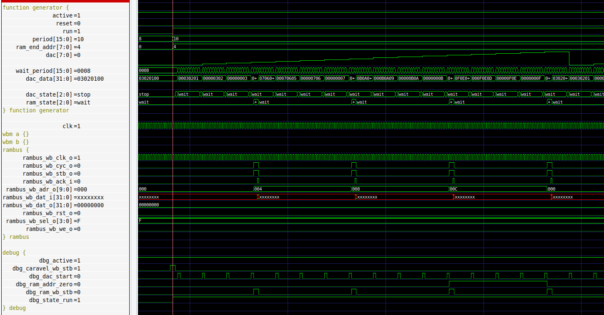

# Zero to ASIC Group submission MPW6

This ASIC was designed by members of the [Zero to ASIC course](https://zerotoasiccourse.com).

This submission was configured and built by the [multi project tools](https://github.com/mattvenn/multi_project_tools) at commit [d457e46af2d86d39c1c2270ae95b828c5d26f518](https://github.com/mattvenn/multi_project_tools/commit/d457e46af2d86d39c1c2270ae95b828c5d26f518).

The configuration files are [projects.yaml](projects.yaml) & [local.yaml](local.yaml). See the CI for how the build works.

    # clone all repos, and include support for shared OpenRAM
    ./multi_tool.py --clone-repos --clone-shared-repos --create-openlane-config --copy-gds --copy-project --openram

    # run all the tests
    ./multi_tool.py --test-all --force-delete

    # build user project wrapper submission
    cd $CARAVEL_ROOT; make user_project_wrapper

    # create docs
    ./multi_tool.py --generate-doc --annotate-image

# Project Index

## Function generator

* Author: Matt Venn
* Github: https://github.com/mattvenn/wrapped_function_generator
* commit: 701095fd880ad3bb80d6cec1d214a04e5676a65d
* Description: arbitary function generator, using shared RAM as the output data

## CPR

* Author: Zorkan ERKAN
* Github: https://github.com/zorkan/cpr
* commit: d0108b8b896cb1a952a98252f8ad5a516eb7cfcc
* Description: Developed in accordance with the Aha Standard.

## instrumented adder - behavioural

* Author: Matt Venn & Teo
* Github: https://github.com/mattvenn/wrapped_instrumented_adder
* commit: 3f4ecc54789723634520b3f780c8d0e9cc7ca25f
* Description: adds a precise timer to optimised hardware adders to measure how fast they are

## instrumented adder - sklansky

* Author: Matt Venn & Teo
* Github: https://github.com/mattvenn/wrapped_instrumented_adder
* commit: e03234240886bf383a795639fa367449af0d8159
* Description: adds a precise timer to optimised hardware adders to measure how fast they are

## instrumented adder - Brent Kung

* Author: Matt Venn & Teo
* Github: https://github.com/mattvenn/wrapped_instrumented_adder
* commit: 0874228702abd86963615161a63b1eafce4bd95b
* Description: adds a precise timer to optimised hardware adders to measure how fast they are

## instrumented adder - Ripple carry

* Author: Matt Venn & Teo
* Github: https://github.com/mattvenn/wrapped_instrumented_adder
* commit: 5c1bd6838e21b7be080d99ec564f89196b5177fb
* Description: adds a precise timer to optimised hardware adders to measure how fast they are

## instrumented adder - Kogge Stone

* Author: Matt Venn & Teo
* Github: https://github.com/mattvenn/wrapped_instrumented_adder
* commit: ab5f6a2cc1da5fbdb6d4a22bdfcb502147cbe2a8
* Description: adds a precise timer to optimised hardware adders to measure how fast they are

## Wavelet Transform

* Author: Gregory Kielian
* Github: https://github.com/opensource-fr/wrapped_wavelet_transform
* commit: 28d8e5434ac8d74fbeb144382ba30574eb9f3f20
* Description: Implementation Wavelet Transform with 3 filter banks

## PrimitiveCalculator

* Author: Emre Hepsag
* Github: https://github.com/eemreeh/wrapped_PrimitiveCalculator
* commit: cb64da0d1b9f5a622a02ee1793c288a04bf580ce
* Description: description

## snn-accelerator

* Author: Jason K. Eshraghian
* Github: https://github.com/jeshraghian/snn-accelerator
* commit: aea4db644906e85577d58432e385d885566be87e
* Description: Lightweight Spiking Neural Network Accelerator in SKY130

## scan chain test

* Author: Matt Venn
* Github: https://github.com/mattvenn/wrapped_scan_test
* commit: bc7706bbd5f524a901fcaf520cdf8fbedee2223c
* Description: testing a simple scan chain for very small designs

