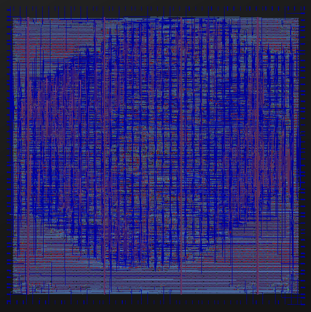

# Zero to ASIC Group submission MPW6

This ASIC was designed by members of the [Zero to ASIC course](https://zerotoasiccourse.com).

This submission was configured and built by the [multi project tools](https://github.com/mattvenn/multi_project_tools) at commit [43bbb63412b0790882ee1d133f3edc24c0d6d8c7](https://github.com/mattvenn/multi_project_tools/commit/43bbb63412b0790882ee1d133f3edc24c0d6d8c7).

    # clone all repos, and include support for shared OpenRAM
    ./multi_tool.py --clone-repos --clone-shared-repos --create-openlane-config --copy-gds --copy-project --openram

    # run all the tests
    ./multi_tool.py --test-all --force-delete

    # build user project wrapper submission
    cd $CARAVEL_ROOT; make user_project_wrapper

    # create docs
    ./multi_tool.py --generate-doc --annotate-image

# Project Index

## Function generator

* Author: Matt Venn
* Github: https://github.com/mattvenn/wrapped_function_generator
* commit: 701095fd880ad3bb80d6cec1d214a04e5676a65d
* Description: arbitary function generator, using shared RAM as the output data

## instrumented adder - behavioural

* Author: Matt Venn & Teo
* Github: https://github.com/mattvenn/wrapped_instrumented_adder
* commit: e74291a92ae1ded50b8c265f65df0d1bad6e5abe
* Description: adds a precise timer to optimised hardware adders to measure how fast they are

## instrumented adder - sklansky

* Author: Matt Venn & Teo
* Github: https://github.com/mattvenn/wrapped_instrumented_adder
* commit: 36c620b89f803be1aaded8181c8deade606ba88b
* Description: adds a precise timer to optimised hardware adders to measure how fast they are

## instrumented adder - Brent Kung

* Author: Matt Venn & Teo
* Github: https://github.com/mattvenn/wrapped_instrumented_adder
* commit: 7bfab207ba7b18ad6d1f83a29cb0ae93503bcc41
* Description: adds a precise timer to optimised hardware adders to measure how fast they are

## instrumented adder - Ripple carry

* Author: Matt Venn & Teo
* Github: https://github.com/mattvenn/wrapped_instrumented_adder
* commit: 0d597ecc85c48b940fd5835f4e41f5e1edb2f729
* Description: adds a precise timer to optimised hardware adders to measure how fast they are

## instrumented adder - Kogge Stone

* Author: Matt Venn & Teo
* Github: https://github.com/mattvenn/wrapped_instrumented_adder
* commit: 9c2640ad709d77cfc568c63cf7749e3d39a272be
* Description: adds a precise timer to optimised hardware adders to measure how fast they are

## Wavelet Transform

* Author: Gregory Kielian
* Github: https://github.com/opensource-fr/wrapped_wavelet_transform
* commit: 28d8e5434ac8d74fbeb144382ba30574eb9f3f20
* Description: Implementation Wavelet Transform with 3 filter banks

## PrimitiveCalculator

* Author: Emre Hepsag
* Github: https://github.com/eemreeh/wrapped_PrimitiveCalculator
* commit: cb64da0d1b9f5a622a02ee1793c288a04bf580ce
* Description: description

