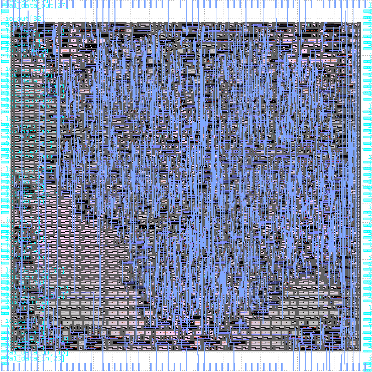

# Zero to ASIC Group submission MPW6

This ASIC was designed by members of the [Zero to ASIC course](https://zerotoasiccourse.com).

This submission was configured and built by the [multi project tools](https://github.com/mattvenn/multi_project_tools) at commit [d5014c812923a7fc00ee521d033a1fd2dd9ac9b4](https://github.com/mattvenn/multi_project_tools/commit/d5014c812923a7fc00ee521d033a1fd2dd9ac9b4).

    # clone all repos, and include support for shared OpenRAM
    ./multi_tool.py --clone-repos --clone-shared-repos --create-openlane-config --copy-gds --copy-project --openram

    # run all the tests
    ./multi_tool.py --test-all --force-delete

    # build user project wrapper submission
    cd $CARAVEL_ROOT; make user_project_wrapper

    # create docs
    ./multi_tool.py --generate-doc --annotate-image

# Project Index

## Function generator

* Author: Matt Venn
* Github: https://github.com/mattvenn/wrapped_function_generator
* commit: 701095fd880ad3bb80d6cec1d214a04e5676a65d
* Description: arbitary function generator, using shared RAM as the output data

## CPR

* Author: Zorkan ERKAN
* Github: https://github.com/zorkan/cpr
* commit: d0afa2172ca45b279d84b8da508d2f608b6ca1b5
* Description: Developed in accordance with the Aha Standard.

## instrumented adder - behavioural

* Author: Matt Venn & Teo
* Github: https://github.com/mattvenn/wrapped_instrumented_adder_behav
* commit: 1a8b88951d9e75e9840c5c0fa66554bd809e2692
* Description: adds a precise timer to optimised hardware adders to measure how fast they are

## instrumented adder - sklansky

* Author: Matt Venn & Teo
* Github: https://github.com/mattvenn/wrapped_instrumented_adder_sklansky
* commit: 28df7ae8c4734bac47d0310c221177db9861ba48
* Description: adds a precise timer to optimised hardware adders to measure how fast they are

## instrumented adder - brent

* Author: Matt Venn & Teo
* Github: https://github.com/mattvenn/wrapped_instrumented_adder_brent
* commit: 6fe7ea3e46cf8bf25b7242047bc838ee3ca0108f
* Description: adds a precise timer to optimised hardware adders to measure how fast they are

## instrumented adder - ripple

* Author: Matt Venn & Teo
* Github: https://github.com/mattvenn/wrapped_instrumented_adder_ripple
* commit: f5d11afec656bd1d83c6a136bae15d53e71ff234
* Description: adds a precise timer to optimised hardware adders to measure how fast they are

## instrumented adder - kogge

* Author: Matt Venn & Teo
* Github: https://github.com/mattvenn/wrapped_instrumented_adder_kogge
* commit: 2e72eb2a75aa896d0c12af2b92b8b0f2ba9c9a2c
* Description: adds a precise timer to optimised hardware adders to measure how fast they are

## PrimitiveCalculator

* Author: Emre Hepsag
* Github: https://github.com/eemreeh/wrapped_PrimitiveCalculator
* commit: cb64da0d1b9f5a622a02ee1793c288a04bf580ce
* Description: description

